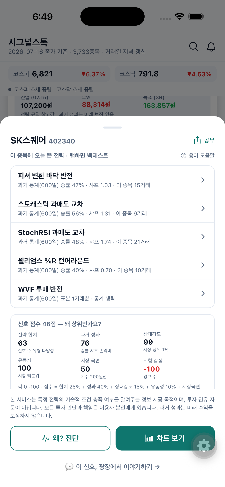
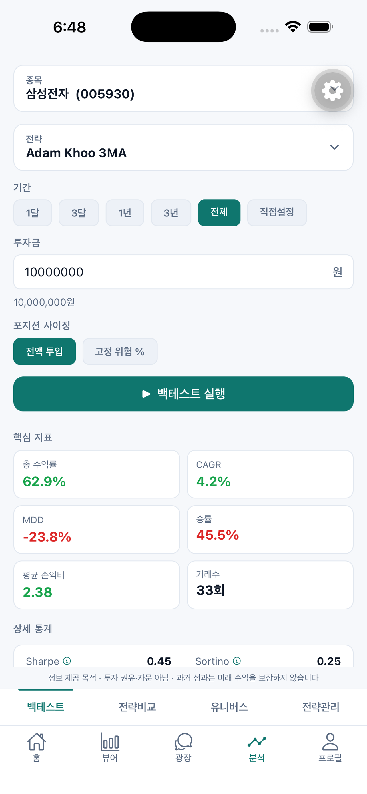
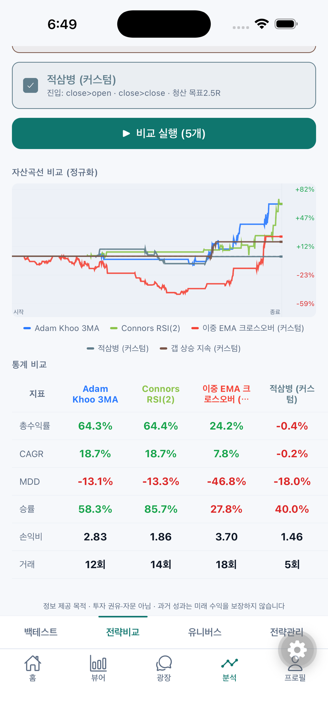

<picture>
  <source media="(prefers-color-scheme: dark)" srcset="assets/wordmark-dark.png">
  
</picture>

### 오늘 뭘 사고, 뭘 팔고, **왜**?

**매일 저녁, 한국 주식 전 종목을 대신 살펴보고 신호와 이유를 알려드립니다.**

📱 iOS App Store **2026년 8월 출시 예정** · 무료

[주요 기능](#-시그널스톡이-하는-일) · [스크린샷](#-화면-미리보기) · [자주 묻는 질문](#-자주-묻는-질문) · [지원·문의](#-지원--문의)

---

## 이런 경험, 있지 않으세요?

- 관심 종목이 늘어날수록 **매일 차트 확인이 숙제**가 된다.
- 유료 리딩방 신호를 받아보지만, **그 신호가 어떤 근거로 나왔는지는 알 수 없다**.
- "20일선 위에서 거래량 터지면 사볼까?" 같은 **나만의 규칙이 실제로 통했는지 확인할 방법이 없다**.
- 결국 감으로 사고, 물리면 그제야 검색한다.

시그널스톡은 이 문제를 **"규칙 → 전 종목 스크리닝 → 신호 + 이유"** 로 풀어냅니다.

## ✨ 시그널스톡이 하는 일

### 🔔 매일 저녁, 전 종목 스크리닝 결과가 도착합니다
코스피·코스닥·ETF **약 3,700개 전 종목**에 수십 가지 검증된 전략 규칙을 똑같이 적용해,
오늘 조건을 충족한 종목만 골라 보여드립니다. 진입 참고가 · 손절 참고가 · 목표 참고가까지
자동 계산됩니다. 장 마감 후 저녁이면 그날의 신호가 정리되어 있고, 원하면 푸시 알림으로도
받아볼 수 있습니다.

### 🔍 모든 신호에는 "왜"가 붙어 있습니다
어떤 전략이, 어떤 조건으로, 과거에는 어떤 성적(승률·손익비·샤프지수)이었는지를 신호마다
투명하게 보여줍니다. 근거 없는 "매수 추천"이 아니라, **당신이 직접 판단할 수 있는 통계**를
드립니다.

### 📊 따라 하기 전에, 먼저 검증하세요
마음에 든 전략을 원하는 종목·기간에 **백테스트**해볼 수 있습니다. 승률·손익비·최대낙폭은
기본이고, "운이 나빴다면 어디까지 밀렸을까"(몬테카를로 시뮬레이션), "이 승률을 얼마나 믿어도
되나"(신뢰구간)까지. **거래 표본이 너무 적으면 숫자 대신 "아직 신뢰하기 어렵다"고 솔직하게
말합니다.**

### 🛠️ 코딩 없이 나만의 전략도 만들 수 있습니다
이동평균·RSI·볼린저밴드 같은 지표를 블록처럼 조합해 나만의 매수·매도 규칙을 만들고, 저장
전에 바로 백테스트로 확인하세요. 만든 전략은 전 종목 스크리닝에도 그대로 쓸 수 있습니다.

### 💬 광장에서 가볍게 이야기 나누세요
시장·전략·공부 이야기를 짧게 나누는 커뮤니티가 앱 안에 있습니다. 오늘 받은 신호 카드를
인용해 의견을 물어볼 수도 있습니다.

### 🔓 로그인 없이도 둘러볼 수 있습니다
게스트 모드로 핵심 기능을 바로 체험하고, 마음에 들면 로그인 한 번으로 전체 기능이 열립니다.
이메일 외에 네이버·Google·Apple 계정으로 간편하게 시작할 수 있습니다. **결제도, 카드 등록도
없습니다.**

## 📱 화면 미리보기

| 오늘의 신호 | 신호의 이유 | 백테스트 | 차트와 기준선 | 전략 비교 |
|:---:|:---:|:---:|:---:|:---:|
|  |  |  |  |  |
| 매일 저녁 갱신되는 전 종목 신호 피드 | 어떤 전략이 왜 걸렸는지 한눈에 | 숫자로 확인하는 과거 성적 | 진입·손절·목표 참고선까지 | 여러 전략을 나란히 검증 |

## 🤔 자주 묻는 질문

**Q. 자동으로 매매해주는 앱인가요?**
아니요. 시그널스톡은 매매를 실행하지 않습니다. 전략 규칙의 조건 충족 여부와 그 통계를
보여주는 **정보 제공 앱**이며, 실제 매매는 이용하시는 증권사 앱에서 직접 하시게 됩니다.

**Q. 종목을 추천해주는 건가요?**
아니요. 특정 종목의 매수·매도를 권유하지 않습니다. 이용자가 선택한 알고리즘 규칙을 전
종목에 동일하게 적용한 **통계 정보**를 보여드릴 뿐이며, 투자 판단은 이용자 본인의 몫입니다.

**Q. 정말 무료인가요?**
네. 현재 모든 기능이 무료입니다. 로그인만 하면 제한 없이 사용할 수 있습니다.

**Q. 어떤 시장을 다루나요?**
한국 주식(코스피·코스닥)과 국내 상장 ETF의 일봉 데이터를 다룹니다.

## 📲 다운로드

- **iOS (App Store)** — 심사 진행 중, **2026년 8월 출시 예정**입니다. 출시되면 이곳에 링크가 올라옵니다.
- **Android (Google Play)** — 준비 중입니다.

## 💬 지원 · 문의

- 앱 내 **프로필 → 문의하기**로 접수해주시면 앱 내 답변으로 안내됩니다.
- [지원 페이지](https://leon-real.github.io/signalstock-legal/) · [개인정보처리방침](https://leon-real.github.io/signalstock-legal/privacy-policy.html) · [이용약관](https://leon-real.github.io/signalstock-legal/terms.html)

---

**꼭 알아두세요** — 시그널스톡이 제공하는 신호·백테스트·전략 비교는 이용자가 선택하거나
설정한 알고리즘을 전 종목에 동일하게 적용한 **통계 정보**이며, 특정 종목의 매수·매도를
권유하거나 개인별로 맞춤 자문하는 것이 아닙니다. 투자 판단과 그 결과에 대한 책임은 이용자
본인에게 있으며, **과거 성과가 미래 수익을 보장하지 않습니다.**

© 2026 시그널스톡 (SignalStock). 이 저장소는 시그널스톡의 공식 소개·법적 고지
페이지입니다.
