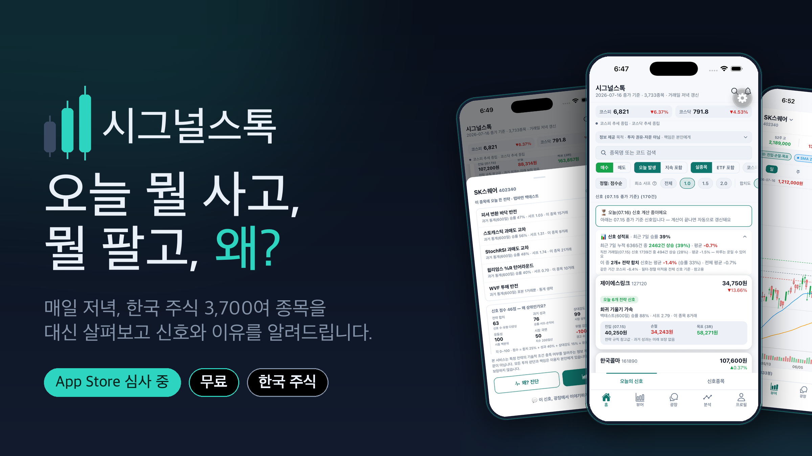
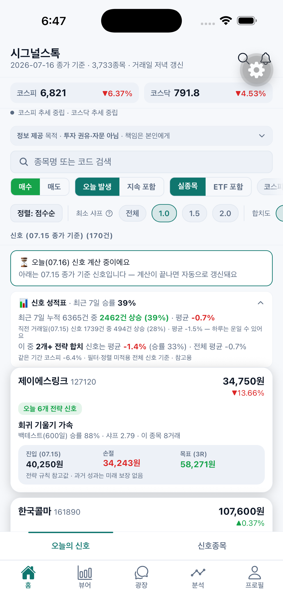
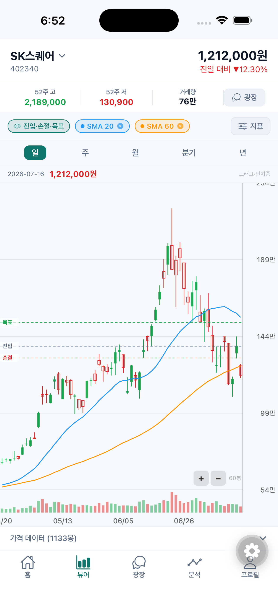

 

### 감이 아니라 데이터로. 매일 저녁, 전 종목을 대신 살펴봐 드립니다.

**리딩방도, 매일 하는 차트 노가다도 이제 그만.**
한국 주식 3,700여 종목을 매일 스크리닝해 **오늘의 매수·위험·청산 신호**와 **그 이유(근거·통계)**를 알려주는 정보 제공 앱.

 

|  |  |  |
|:---:|:---:|:---:|
| 🔔 **뭘 사?** | 📉 **뭘 팔아?** | 🔍 **왜?** |
| 매일 저녁 전 종목 스크리닝 | 보유·활성 종목의 청산·위험 신호 | 모든 신호에 근거와 과거 통계 |

 

---

## 😩 이런 경험, 있지 않으세요?

> - 관심 종목이 늘수록 **매일 차트 확인이 숙제**가 된다.
> - 유료 리딩방 신호를 받지만, **그게 무슨 근거로 나온 건지는 알 수 없다.**
> - "20일선 위에서 거래량 터지면 사볼까?" 같은 **나만의 규칙이 진짜 통했는지 확인할 방법이 없다.**
> - 결국 감으로 사고, 물리면 그제야 검색한다.

**시그널스톡은 이걸 "규칙 → 전 종목 스크리닝 → 신호 + 이유"로 풀어냅니다.**

 

## ✨ 무엇을 할 수 있나요

<table>
<tr>
<td width="55%" valign="top">

### 🔔 매일 저녁, 신호가 도착합니다
장 마감 후, 코스피·코스닥·ETF **전 종목**에 수십 가지 검증된 전략 규칙을 똑같이 적용해 오늘 조건을 충족한 종목만 골라 드립니다. **진입·손절·목표 참고가**까지 자동 계산. 원하면 푸시 알림으로도.

### 🔍 모든 신호에 "왜"가 붙어 있습니다
어떤 전략이, 어떤 조건으로, 과거엔 어떤 성적(승률·손익비·샤프)이었는지 신호마다 투명하게. **근거 없는 "매수 추천"이 아니라, 당신이 직접 판단할 통계**를 드립니다.

### 📊 따라 하기 전에, 먼저 검증하세요
마음에 든 전략을 원하는 종목·기간에 **백테스트**. 승률·손익비·최대낙폭은 기본, "운이 나빴다면 어디까지?"(몬테카를로)·"이 승률 믿어도 되나?"(신뢰구간)까지. **표본이 적으면 "아직 신뢰하기 어렵다"고 솔직하게 말합니다.**

</td>
<td width="45%" valign="top" align="center">

**오늘의 신호** — 매일 저녁 갱신되는 전 종목 신호 피드

</td>
</tr>
</table>

<table>
<tr>
<td width="45%" valign="top" align="center">

**왜?** — 어떤 전략이 왜 이 종목을 포착했는지

</td>
<td width="55%" valign="top">

### 🛠️ 코딩 없이 나만의 전략도
이동평균·RSI·볼린저밴드 같은 지표를 **블록처럼 조합**해 나만의 매수·매도 규칙을 만들고, 저장 전에 바로 백테스트로 확인. 만든 전략은 전 종목 스크리닝에도 그대로.

### 💬 광장에서 가볍게 이야기 나눠요
시장·전략·공부 이야기를 짧게 나누는 커뮤니티가 앱 안에. 오늘 받은 **신호 카드를 인용**해 의견을 물어볼 수도 있습니다.

### 🔓 로그인 없이도 둘러볼 수 있어요
게스트 모드로 핵심 기능을 바로 체험하고, 마음에 들면 로그인 한 번으로 전체 기능이 열립니다. 이메일 외 **네이버·Google·Apple** 계정으로 간편하게. **결제도, 카드 등록도 없습니다.**

</td>
</tr>
</table>

 

## 📱 화면 미리보기

<table>
<tr>
<td align="center" width="20%">오늘의 신호</td>
<td align="center" width="20%">신호의 이유</td>
<td align="center" width="20%">백테스트</td>
<td align="center" width="20%">차트·기준선</td>
<td align="center" width="20%">전략 비교</td>
</tr>
</table>

 

## 🤔 자주 묻는 질문

<b>자동으로 매매해주는 앱인가요?</b>

 

아니요. 시그널스톡은 매매를 실행하지 않습니다. 전략 규칙의 **조건 충족 여부와 통계**를 보여주는 **정보 제공 앱**이며, 실제 매매는 이용하시는 증권사 앱에서 직접 하시게 됩니다.

<b>종목을 추천해주는 건가요?</b>

 

아니요. 특정 종목의 매수·매도를 권유하지 않습니다. 이용자가 선택한 알고리즘 규칙을 전 종목에 동일하게 적용한 **통계 정보**를 보여드릴 뿐이며, 투자 판단은 이용자 본인의 몫입니다.

<b>정말 무료인가요?</b>

 

네. 현재 모든 기능이 무료입니다. 로그인만 하면 제한 없이 사용할 수 있습니다.

<b>어떤 시장을 다루나요?</b>

 

한국 주식(코스피·코스닥)과 국내 상장 ETF의 일봉 데이터를 다룹니다.

 

## 📲 다운로드

| iOS (App Store) | Android (Google Play) |
|:---:|:---:|
| **심사 진행 중** 🍏 | 준비 중 🤖 |
| 출시되는 대로 이곳에 링크가 올라옵니다 | |

 

## 💬 지원 · 문의

앱 내 **프로필 → 문의하기**로 접수해주시면 앱 내 답변으로 안내됩니다.

 

---

**꼭 알아두세요** — 시그널스톡이 제공하는 신호·백테스트·전략 비교는 이용자가 선택·설정한 알고리즘을 전 종목에 동일하게 적용한 **통계 정보**이며, 특정 종목의 매수·매도를 권유하거나 개인별로 맞춤 자문하는 것이 아닙니다. 투자 판단과 그 결과에 대한 책임은 이용자 본인에게 있으며, **과거 성과가 미래 수익을 보장하지 않습니다.**

© 2026 시그널스톡 (SignalStock) · 이 저장소는 시그널스톡의 공식 소개·법적 고지 페이지입니다.

