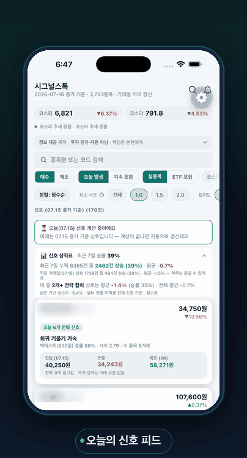
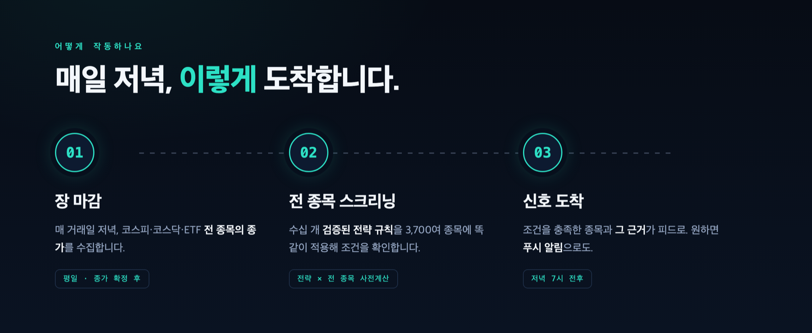
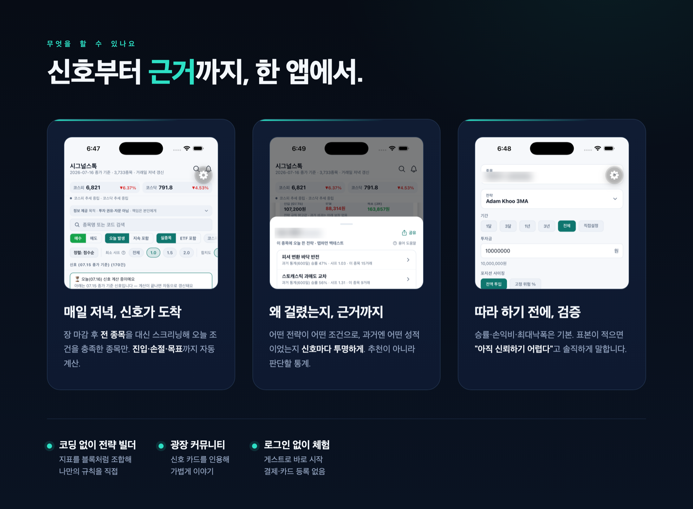
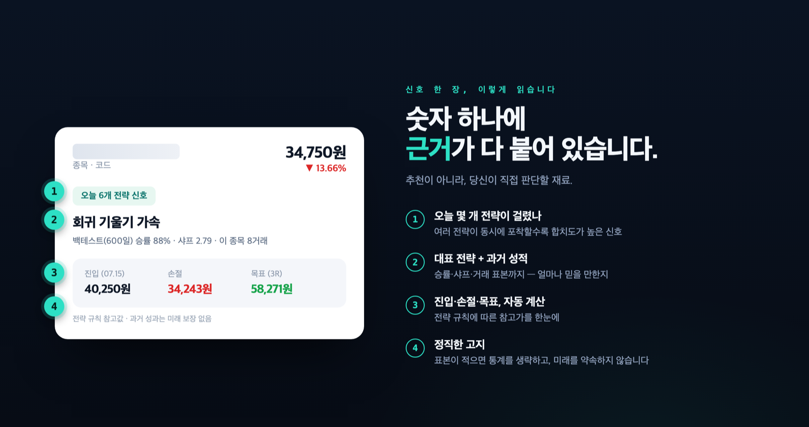
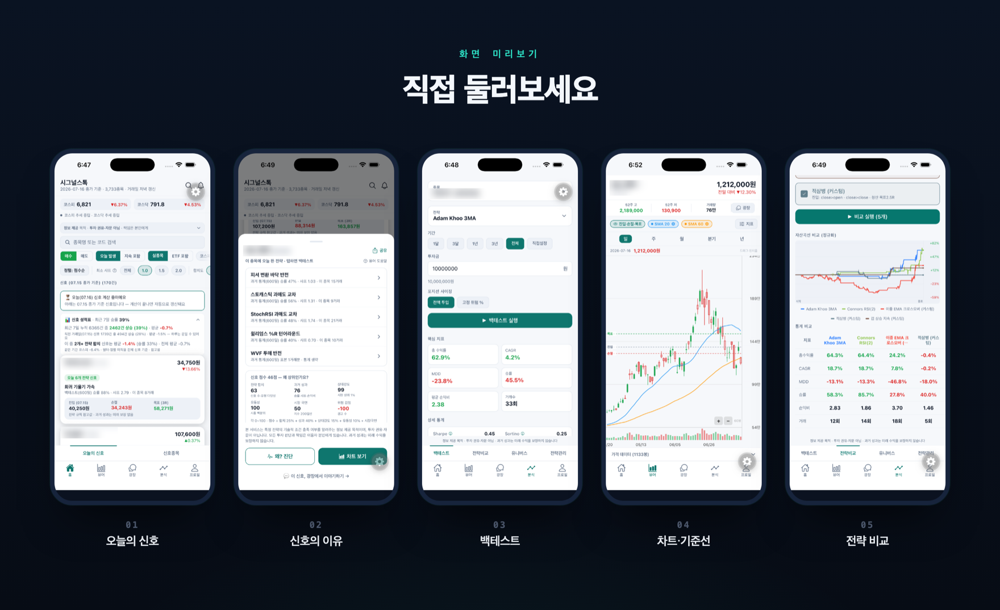

  

### [웹사이트에서 보기 →](https://leon-real.github.io/signalstock-legal/)

스크롤·애니메이션까지 담은 소개 페이지 · `leon-real.github.io/signalstock-legal`

 

### 움직이는 화면으로 먼저 보기

 

**리딩방도, 매일 하는 차트 노가다도 이제 그만.**

관심 종목이 늘수록 매일 차트 확인이 숙제가 되고,
유료 신호는 무슨 근거인지 알 수 없고,
나만의 규칙이 진짜 통했는지 확인할 방법이 없습니다.

시그널스톡은 이걸 **규칙 → 전 종목 스크리닝 → 신호 + 이유** 로 풀어냅니다.

 

  

  

  

 

## 자주 묻는 질문

<b>자동으로 매매해주는 앱인가요?</b>

 

아니요. 시그널스톡은 매매를 실행하지 않습니다. 전략 규칙의 **조건 충족 여부와 통계**를 보여주는 **정보 제공 앱**이며, 실제 매매는 이용하시는 증권사 앱에서 직접 하시게 됩니다.

<b>종목을 추천해주는 건가요?</b>

 

아니요. 특정 종목의 매수·매도를 권유하지 않습니다. 이용자가 선택한 알고리즘 규칙을 전 종목에 동일하게 적용한 **통계 정보**를 보여드릴 뿐이며, 투자 판단은 이용자 본인의 몫입니다.

<b>어떤 전략을 쓰나요?</b>

 

추세추종·평균회귀·돌파·거래량 등 **검증된 전략 수십 종**을 제공합니다. 이동평균·RSI·볼린저밴드 같은 지표를 조합해 **나만의 전략을 직접** 만들 수도 있고, 저장 전에 바로 백테스트로 확인할 수 있습니다.

<b>정말 무료인가요?</b>

 

네. 현재 모든 기능이 무료입니다. 로그인만 하면 제한 없이 사용할 수 있습니다.

<b>어떤 시장을 다루나요?</b>

 

한국 주식(코스피·코스닥)과 국내 상장 ETF의 일봉 데이터를 다룹니다.

 

## 다운로드

**iOS · App Store** — 심사 진행 중입니다. 출시되는 대로 이곳에 다운로드 링크가 올라옵니다.
**Android · Google Play** — 준비 중입니다.

 

## 링크

| | 주소 |
|---|---|
| **웹사이트 (소개·지원)** | https://leon-real.github.io/signalstock-legal/ |
| 개인정보처리방침 | https://leon-real.github.io/signalstock-legal/privacy-policy.html |
| 이용약관 | https://leon-real.github.io/signalstock-legal/terms.html |
| 문의 | [tutmr999@naver.com](mailto:tutmr999@naver.com) · 또는 앱 내 **프로필 → 문의하기** |
| iOS · App Store | 심사 진행 중 (출시되는 대로 이곳에 링크 추가) |

 

---

> **꼭 알아두세요** — 시그널스톡이 제공하는 신호·백테스트·전략 비교는 이용자가 선택·설정한 알고리즘을 전 종목에 동일하게 적용한 **통계 정보**이며, 특정 종목의 매수·매도를 권유하거나 개인별로 맞춤 자문하는 것이 아닙니다. 투자 판단과 그 결과에 대한 책임은 이용자 본인에게 있으며, **과거 성과가 미래 수익을 보장하지 않습니다.**

© 2026 시그널스톡 (SignalStock) · 이 저장소는 시그널스톡의 공식 소개·법적 고지 페이지입니다.

